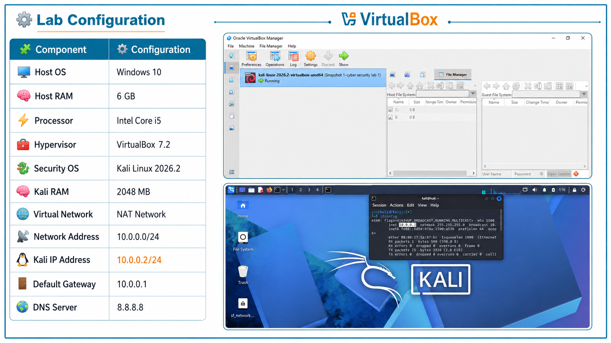
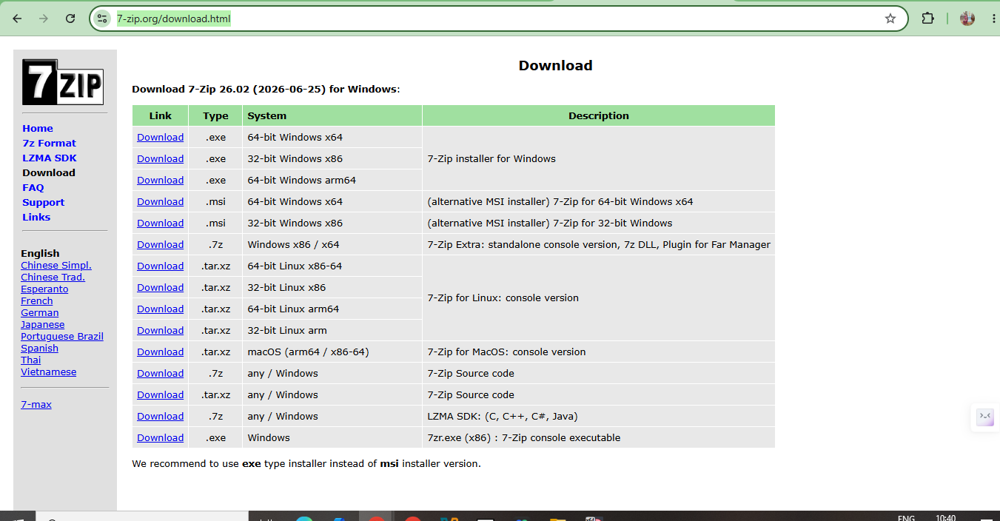
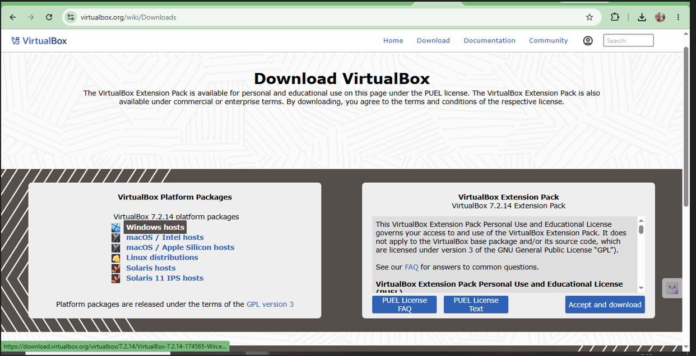
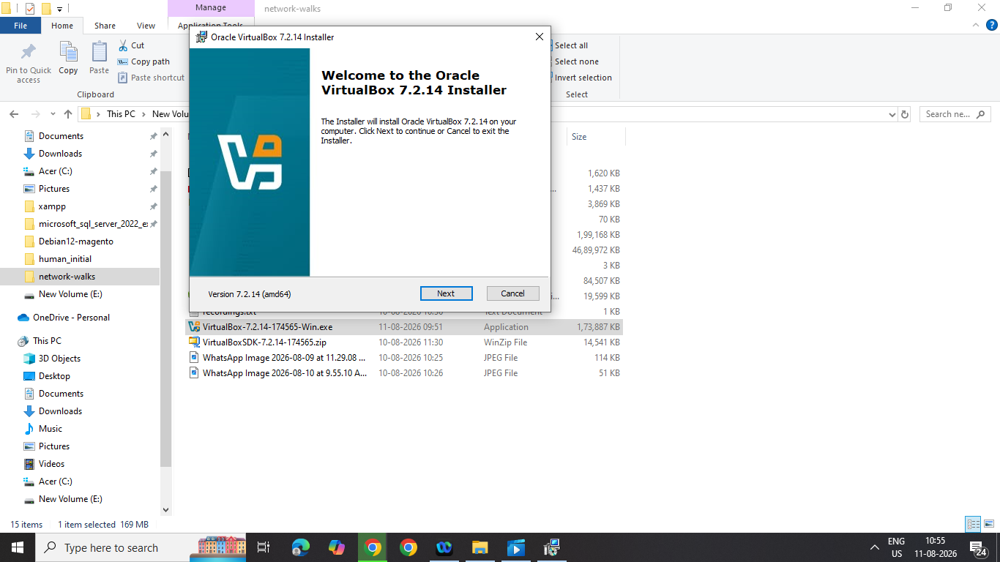
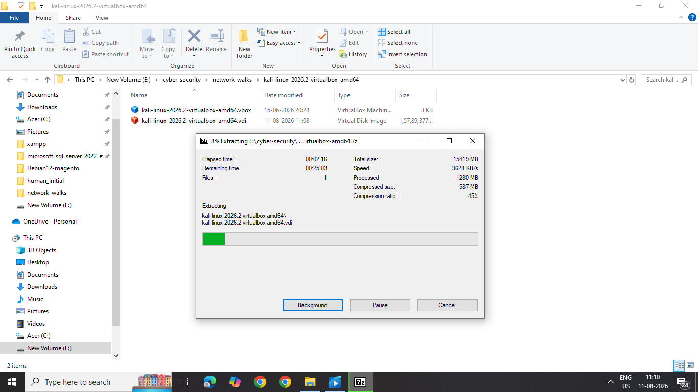
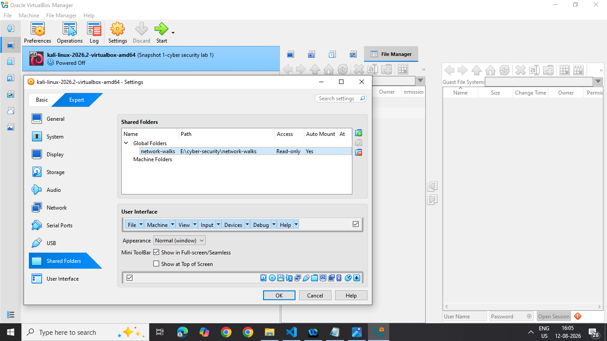
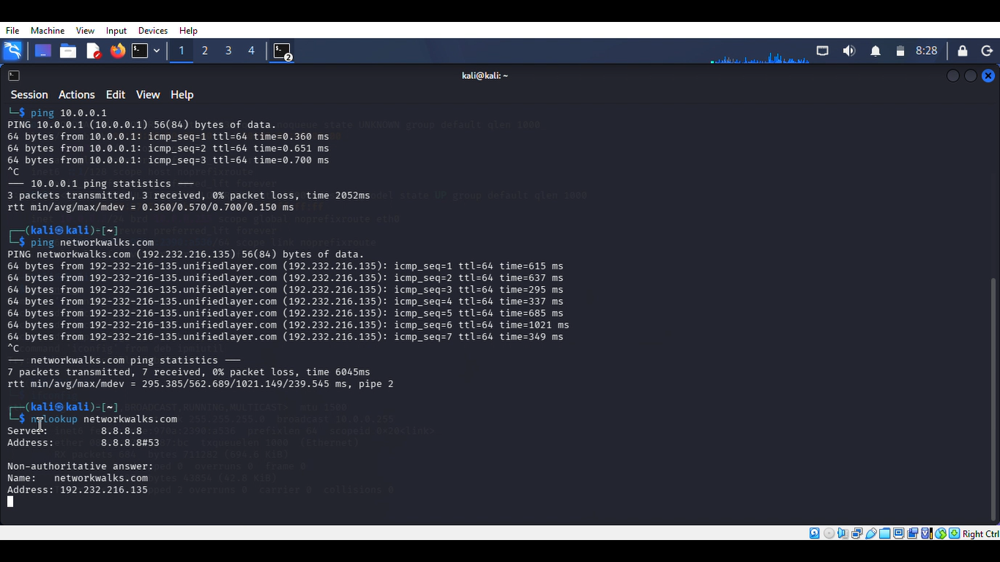

# 🔐 Cybersecurity Lab Environment Setup

**Building an isolated virtual lab for penetration testing and ethical hacking practice**

---

## 📌 Project Overview

This project focuses on setting up a **virtual cybersecurity and penetration-testing laboratory** using VirtualBox and Kali Linux.

The purpose of the lab is to create a controlled environment where cybersecurity tools, network scanning, reconnaissance, vulnerability assessment, and other security-testing activities can be performed safely and repeatedly.

The lab is configured on a private virtual network so that additional machines can be added later and used as targets for authorized security testing.

---


## 🎯 Objectives

The main objectives of this project are to:

- Install and configure VirtualBox.
- Install/import Kali Linux as a virtual machine.
- Create a private **NAT Network** for the cybersecurity lab.
- Configure network connectivity for Kali Linux.
- Assign a consistent IP address to the Kali VM.
- Verify network connectivity and DNS resolution.
- Take a clean VM snapshot for recovery.
- Document the complete setup process.
- Prepare the environment for future cybersecurity projects.

---

## 🛡️ Purpose of the Lab

The lab provides an isolated and controlled environment for cybersecurity learning and authorized security testing.

It can be used for activities such as:

- Network reconnaissance
- Port scanning
- Vulnerability assessment
- Packet analysis
- Web security testing
- Exploitation practice
- Security-tool experimentation


---

## 🏗️ Lab Architecture




Additional target machines can be added to the same virtual network in future projects.

---

## ⚙️ Lab Configuration

| 🧩 Component       | ⚙️ Configuration   |
| ------------------ | ------------------  |
| 🖥️ Host OS         | Windows 10         |
| 🧠 Host RAM        | 6 GB               |
| ⚡ Processor       | Intel Core i5      |
| 🧰 Hypervisor      | VirtualBox 7.2  |
| 🐉 Security OS     | Kali Linux 2026.2  |
| 🧠 Kali RAM        | 2048 MB            |
| 🌐 Virtual Network | NAT Network        |
| 📡 Network Address | 10.0.0.0/24        |
| 🐧 Kali IP Address | 10.0.0.2/24        |
| 🚪 Default Gateway | 10.0.0.1           |
| 🌍 DNS Server      | 8.8.8.8            |
| 🔮 Future VM Range | 10.0.0.3–10.0.0.99 |

---

# 🪜 Lab Setup Procedure

## Step 1. Install 7-Zip

* The Kali Linux VM files need to be extracted and prepared before importing them into the virtualization environment.
* 7-Zip was installed to extract the Kali Linux virtual-machine package, which may be distributed as a `.7z` archive.

Download link: https://www.7-zip.org/download.html




## Result
**Status:** ✅ Completed

---

## Step 2. Install VirtualBox

* VirtualBox provides the virtualized environment required t o run Kali Linux as a separate virtual machine.
* VirtualBox was installed as the hypervisor for the cybersecurity laboratory.

Download link: https://www.virtualbox.org/wiki/Downloads




## Result
**Status:** ✅ Completed
---

## Step 3. Create the NAT Network

* The NAT Network provides a controlled virtual networking environment for the laboratory machines.
* So a dedicated NAT Network was created in VirtualBox.

Configuration:
Network Name: NatNetwork
IPv4 Prefix:  10.0.0.0/24
DHCP:         Enabled
IPv6:         Disabled


A **NAT Network** was selected because multiple virtual machines connected to the same NAT Network can communicate with one another while also having outbound network connectivity.

This will allow future attacker and target VMs to communicate within the lab.

## Result
**Status:** ✅ Completed
---

## Step 4. Import Kali Linux

* Kali Linux is used as the primary cybersecurity operating environment for practical security learning, laboratory exercises, and authorized security testing.
* Downloaded and imported the **Kali Linux virtual machine** into Oracle VirtualBox and connected the VM to the configured `NatNetwork`.

Download link: https://www.kali.org/get-kali/#kali-virtual-machines




The VM network adapter was configured as follows:

```text
Adapter 1
Attached to: NAT Network
Network:     NatNetwork
Adapter Type: Intel PRO/1000 MT Desktop
```

The VM was allocated:

```text
RAM: 2048 MB
```
vm


A shared folder was also configured for transferring required files between the host operating system and the Kali VM.



## Result
**Status:** ✅ Completed
---

## Step 5. Configure the Kali Linux Network

The Kali Linux network configuration was checked and configured with a consistent IPv4 address.

Example configuration:

```text
IP Address: 10.0.0.2
Subnet Mask: 255.255.255.0
Gateway: 10.0.0.1
DNS: 8.8.8.8
```

A consistent IP address makes it easier to document the lab and reference the Kali machine in future exercises.


---

## Step 6. Create a Clean VM Snapshot

After completing the initial configuration, a VirtualBox snapshot was created.

Example snapshot name: Snapshot 1 - cyber security lab1

```text
Clean Kali - Network Setup
```

The snapshot represents the clean baseline of the laboratory.

If a future exercise changes or damages the VM configuration, the machine can be restored to this baseline.


---

# 🔎 Lab Verification

| ✅ Test                        | 🧾 Command                      | 🎯 Expected Result              |
| ----------------------------- | ------------------------------- | ------------------------------- |
| 🌐 Check IP address           | `ip a`                          | Correct Kali IP displayed       |
| 📡 Test gateway               | `ping 10.0.0.1`                 | Successful replies              |
| 🌍 Test Internet connectivity | `ping 8.8.8.8`                  | Successful replies              |
| 🔎 Test DNS resolution        | `nslookup networkwalks.com`     | Domain resolves                 |
| 🧰 Verify Nmap                | `nmap --version`                | Nmap version displayed          |
| 🔄 Verify snapshot            | Restore snapshot and run `ip a` | Baseline configuration restored |

### Example Results

```text
IP Address:
10.0.0.2/24

Gateway:
10.0.0.1

DNS:
8.8.8.8
```

---

# 🐞 Expected Problems & Solutions

Since I have been already worked on other Hypervisors and Kali linux 2025 version, I did not face any issues while launching the virtual machine, but you might face some problems as follows:

## Problem 1. Internet Connectivity After Static IP Configuration 

After manually configuring the IPv4 settings, Internet connectivity may fail depending on the Kali/NetworkManager configuration.

You can solve this problem by running following command in kali linux virtual machine

```bash
sudo nmcli connection modify "Wired connection 1" ipv4.dad-timeout 0
```

In this process, network connection will be restarted/rebooted and connectivity will set to active state.

> **Important:** Network interface and connection names may differ between systems. Students should first identify their actual connection name before running an `nmcli` command.

---

## Problem 2. VirtualBox VT-x / Virtualization Error

in some systems / laptos,  VM initially failed to start because hardware virtualization will be in  disabled state in the system firmware/BIOS.

The issue can be resolved by:

1. Restarting the computer.
2. Entering BIOS/UEFI settings.
3. Enabling Intel VT-x / hardware virtualization.
4. Saving the configuration.
5. Restarting the computer.
6. Starting the Kali VM again.

After enabling virtualization, the VM will gets start successfully.


---

# 💡 What I Learned

Through this project, I learned how to create and configure a virtual environmrnt in Oracle Virtualbox hypervisor and Kali linux latest version 2026.02.

The most important concepts I learned include:

### 1. NAT vs NAT Network

A standard NAT configuration and a NAT Network serve different purposes.

A NAT Network allows multiple VMs connected to the same virtual network to communicate with one another while providing network address translation for external connectivity.

### 2. Virtual Machine Networking

I learned how VirtualBox virtual network adapters connect virtual machines to different types of networks and how network configuration affects communication between machines.

### 3. VM Snapshots

I learned that a clean snapshot should be created **before performing risky or experimental activities**.

This provides a known-good recovery point for future cybersecurity exercises.

---

# 🔗 Tools & Resources

- **7-Zip:** [https://7-zip.org/download.html](https://7-zip.org/download.html)
- **VirtualBox:** [https://virtualbox.org/wiki/Downloads](https://virtualbox.org/wiki/Downloads)
- **Kali Linux:** [https://kali.org/get-kali](https://kali.org/get-kali)

---

# 👤 Author

**Geetha Kalladka**\
Cybersecurity Professional B082

LinkedIn: [https://www.linkedin.com/in/geetha-kalladka/]

---

## 📌 Project Information

**Program Name:** Cybersecurity at Networkwalks | **Week:** 01 | **Project:** Cybersecurity & Pentesting Lab Setup | **Repository:** GitHub
